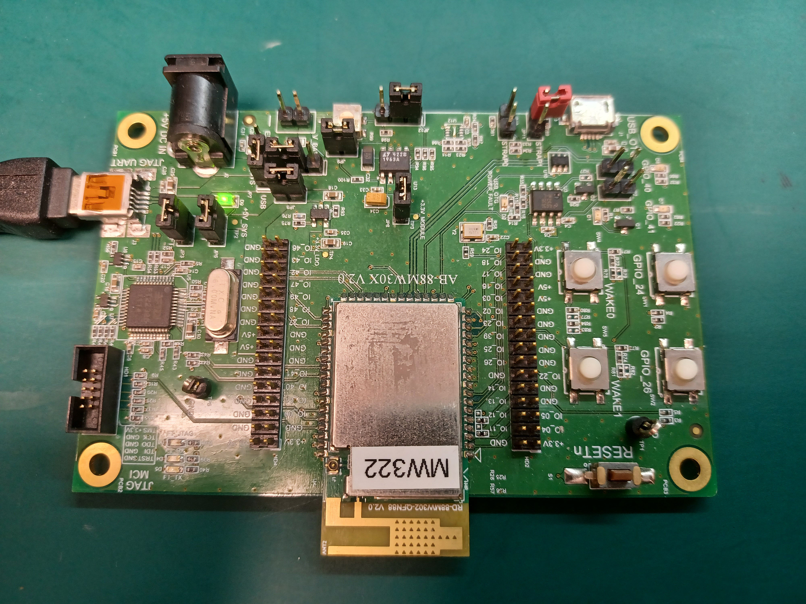
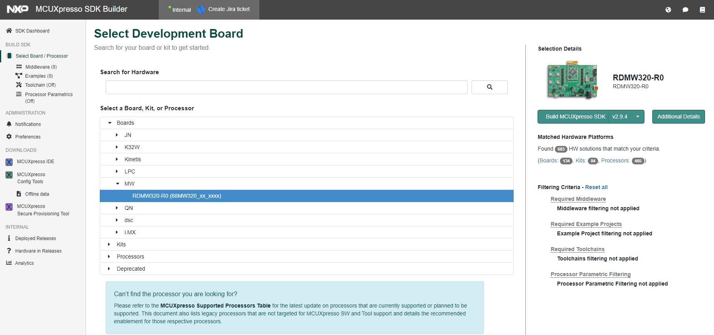

# CHIP MW320 Lighting Example Application

The Matter MW320 Lighting Example demonstrates how to remotely control a light bulb. 
The light bulb is simulated using one of the MW320 platform LED. 
It uses buttons to test turn on/turn off of the light bulb. You can use
this example as a reference for creating your own application.

The example is based on
[Matter](https://github.com/project-chip/connectedhomeip) and the NXP MW320
SDK, and supports remote access and control of a light bulb over a low-power,
WiFi 802.11n network.

The example behaves as a Project CHIP accessory, that is a device that can be
used bypass paired into an existing Matter network and can be controlled by this
network.

<hr>

-   [CHIP MW320 Lighting Example Application](#chip-mw320-lighting-example-application) -
-   [Introduction](#introduction)
-   [Building](#building)
-   [Flashing and debugging](#flashdebug)
-   [Testing the example](#testing-the-example)

<hr>

<a name="intro"></a>

## Introduction



The MW320 lighting example application provides a working demonstration of a
light led device, built using the Matter code base and the NXP MW320
SDK. The example supports remote access (e.g.: using Matter chip Tool from a Ubuntu
laptop) and control of a led light over a low-power, WiFi 802.11n network. It
is capable of being paired into an existing Matter network along with
other Matter-enabled devices.

The example targets the
[NXP MW320 WiFi Micro controller Soc](https://www.nxp.com/products/wireless/wi-fi-plus-bluetooth/88mw32x-802-11n-wi-fi-microcontroller-soc:88MW32X)
development kit.

The Matter device that runs the lighting application is controlled by the CHIP
controller device over the WiFi 802.11 protocol. By default, the CHIP device has
Soft-AP enable with SSID:matter_mw320 WPA2:12345678, and it should be connect over WiFi
network and bypass pairing from other chip tool base on Project CHIP test_event_6 code base. 
The actions required before establishing full communication are described below.

The example also comes with a test mode, which allows to start WiFi Soft-AP with the
default settings. However, this mode does not guarantee
that the device will be able to communicate with the Matter controller and other
devices.

<a name="building"></a>

## Building

In order to build the Matter example, we recommend using a Linux
distribution (the demo-application was compiled on Ubuntu 20.04). 
-   Download [RD-MW320-R0 SDK 2.9.4 for Matter for Matter](https://mcuxpresso.nxp.com/).
    Creating an nxp.com account is required before being able to download the
    SDK. Once the account is created, login and follow the steps for downloading
    SDK 2.9.4. The SDK Builder UI selection should be similar with
    the one from the image below.
    

-   Please create MW320_FOLDER as follow command:
    -   mkdir ~/Desktop/MW320
    -   MW320_SDK_ROOT=~/Desktop/MW320

-   Begin running two script to install and configure MW320 SDK
    -   ./third_party/mw320_sdk/sdk_fixes/patch_mw320_sdk.sh
    -   ./third_party/mw320_sdk/sdk_fixes/set_env.sh

```
user@ubuntu:~/Desktop/git/connectedhomeip$ ./third_party/mw320_sdk/sdk_fixes/patch_mw320_sdk.sh
user@ubuntu:~/Desktop/git/connectedhomeip$ ./third_party/mw320_sdk/sdk_fixes/set_env.sh
```

-   Start building the application either with Matter bypass pairing
    -   with Matter bypass pairing

```
user@ubuntu:~/Desktop/git/connectedhomeip$ cd $MW320_LIGHTING
user@ubuntu:~/Desktop/git/connectedhomeip/examples/lighting-app/mw320$ gn gen out/mw320 --args='chip_bypass_rendezvous=true is_debug=false treat_warnings_as_errors=false'
user@ubuntu:~/Desktop/git/connectedhomeip/examples/lightin-app/mw320$ ninja -v -C out/mw320
```
Please run ./third_party/mw320_sdk/sdk_fixes/mw320_matter_offset.sh for flashing NXP NXP MW320 platform.
The resulting output file can be found in out/mw320/chip-mw320-light-example.mcufw.bin and $MW320_SDK_ROOT/mw320_matter_flash/Matter/chip-mw320-light-example.mcufw.bin.

<a name="flashdebug"></a>

## Flashing and debugging

Connected to Universal Asynchronous Receiver/Transmitter port on MW320 platform to Ubuntu 20 USB port and open Linux text-based serial port communications program at second USB interface. ex. /dev/ttyUSB1.
Please reference the mw320_flash.txt command to flash image to NXP MW320 platform.

After reset NXP MW320 platform, it will show as follow.


## Testing the example

On MW320 side:
Prepare one external AP and try to connect it by running follow command at MW320 console.
> wifi connect "External_AP_SSID" "External_AP_WPA2_PASSWORD"


On Ubuntu20 chip tool side:
Prepare Ubuntu 20 [Matter test_event_6 branch chip tool](https://github.com/project-chip/connectedhomeip/tree/test_event_6/examples/chip-tool) example.
Using the follow chip tool command:
-   Bypass pairing
./chip-tool pairing bypass "IP address" 5540
-   Read MW320 led status
./chip-tool onoff read on-off 1
-   Turn on MW320 led
./chip-tool onoff on 1
-   Turn off MW320 led
./chip-tool onoff off 1


